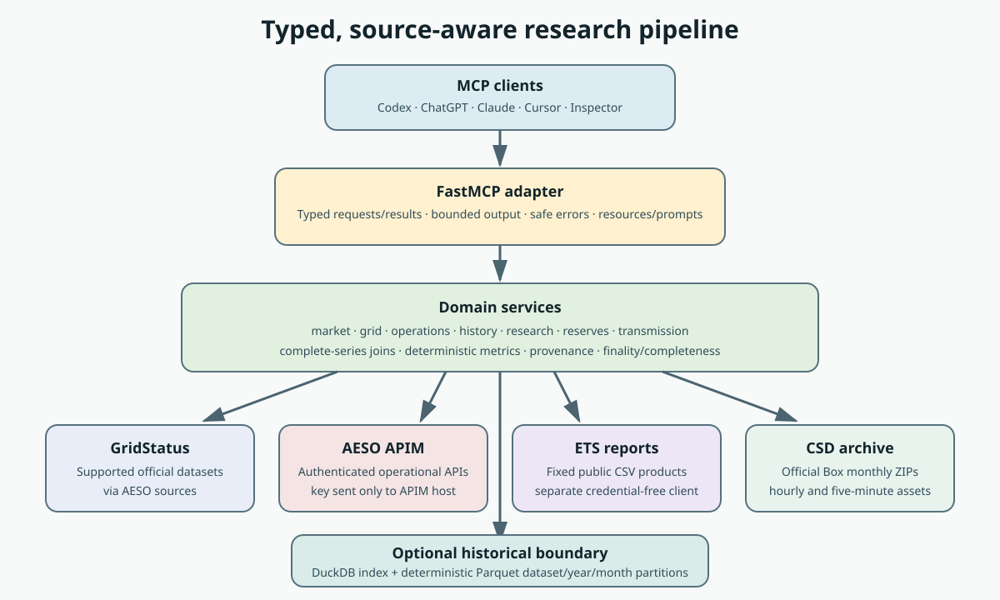
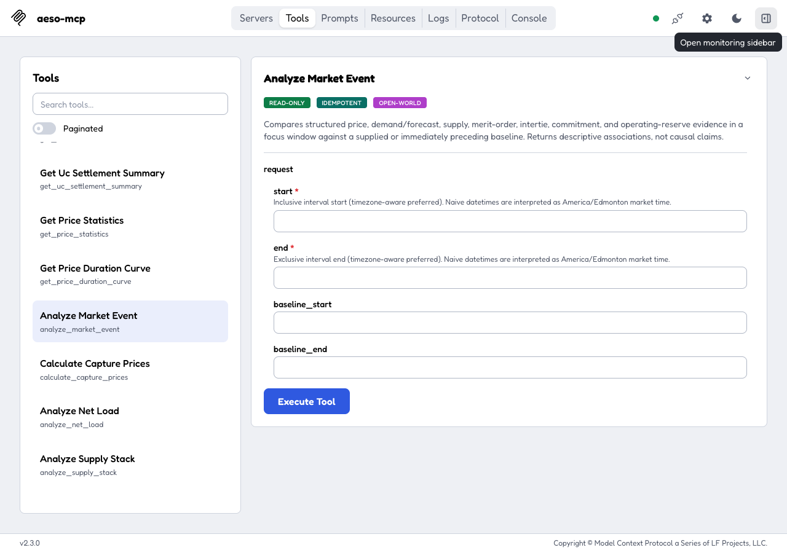

# Architecture

The server keeps protocol adaptation, domain calculations, source access, and optional local
storage as separate boundaries. Analytics consume complete internal source results; public MCP
responses remain typed and bounded. The MCP adapter uses
[stable FastMCP 4.0.10](https://github.com/PrefectHQ/fastmcp/releases/tag/v4.0.10), targets
protocol revision `2026-07-28`, and relies on FastMCP's per-connection negotiation to retain
legacy session-based client support. The full typed tool catalog remains directly visible; the
BM25 progressive-discovery prototype and its evaluation are documented in
[Agent-use evaluation](evals.md#progressive-discovery-prototype).

## Data flow

1. A client discovers typed tools, prompts, and methodology resources through FastMCP.
2. The MCP adapter validates request models and maps domain errors into stable client-safe
   envelopes.
3. Domain services own joins, calculations, pagination policy, provenance, and interpretation
   boundaries.
4. Source adapters choose official AESO APIM, an existing GridStatus implementation, a fixed ETS
   public report, or the fixed official CSD archive.
5. The optional historical boundary indexes normalized observations in DuckDB and rebuilds only
   affected Parquet dataset/year/month partitions.

The APIM key crosses only the authenticated client boundary to `apimgw.aeso.ca`. The ETS and Box
clients are separate, credential-free, host-allow-listed adapters. No MCP tool exposes arbitrary
URLs, SQL, shell execution, or upstream mutations.

## Actual Inspector surface

This screenshot was captured from MCP Inspector against the current repository's stdio entrypoint.
It shows the registered `analyze_market_event` description, safety annotations, and typed request
fields; it is not a hand-drawn mockup.

The generated [MCP catalog](generated/mcp-catalog.md) is the text equivalent used for CI drift
detection and accessible review.
